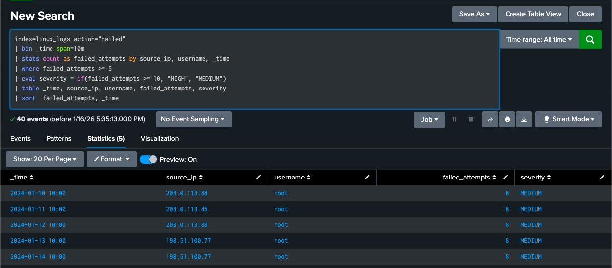
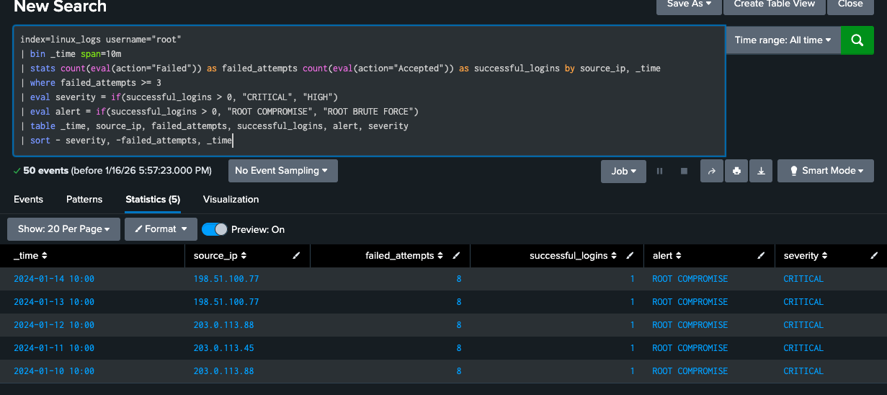

# Linux Attack Analysis

## Overview
Analysis of Linux authentication logs revealed SSH-based attacks targeting root accounts. Attackers used the same infrastructure as Windows attacks, showing coordinated cross-platform targeting.

## What Happened
Daily attacks from January 10-14 with consistent patterns:
- **10:00 AM**: 8 failed SSH attempts on port 4444
- **10:00:15**: Successful SSH login on port 4445
- **Target**: root accounts on Linux servers (192.168.1.100)
- **Method**: Brute force with port evasion techniques

## Key Findings

### Root Account Compromise
- **Critical access**: root privileges obtained daily
- **Pattern**: 8 failed attempts followed by success
- **Consistency**: Same methodology all 5 days
- **Impact**: Full system control on Linux servers

### Evasion Techniques
- **Port hopping**: 4444 for failures, 4445 for success
- **Non-standard ports**: Avoids detection focused only on port 22
- **Source IP rotation**: Same IPs as Windows attacks (203.0.113.88, 198.51.100.77)

### Post-Compromise Activity
- **Follow-up connections**: Additional SSH sessions after initial access
- **Data transfers**: Outbound connections to 198.51.100.99:443

## Detection Queries Developed
1. **Linux SSH Brute Force Detection** - [View query](spl-queries/linux-brute-force-detection-spl)
2. **Root Account Attack Detection** - [View query](spl-queries/linux-root-attacks-detection.spl)
3. **Non-Standard Port Detection** - [View query](spl-queries/linux-port-analysis-spl)

## MITRE ATT&CK Mapping
- **T1110 - Brute Force**: SSH password guessing
- **T1078 - Valid Accounts**: Use of compromised root credentials
- **T1572 - Protocol Tunneling**: Non-standard port usage to evade detection

## Mitigation Steps
1. **Disable root SSH login** and use sudo instead
2. **Implement SSH key-based authentication** instead of passwords
3. **Monitor SSH on all ports**, not just port 22
4. **Review SSH configuration** to restrict authentication methods

## Connection to Other Attacks
Attackers used identical infrastructure and timing patterns across Windows and Linux systems, demonstrating a coordinated campaign.
