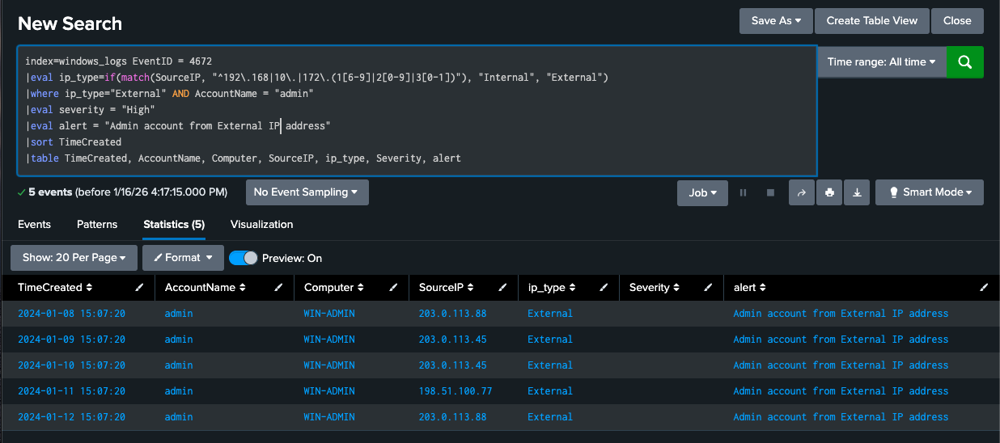
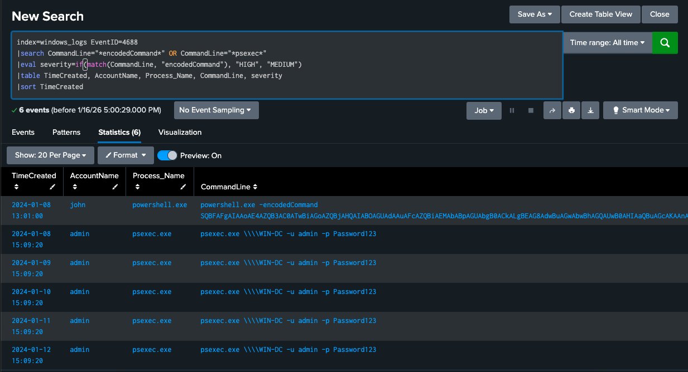

# Windows Attack Analysis

## Overview
Investigation of Windows event logs following firewall breaches revealed a multi-stage attack with credential compromise, privilege escalation, and attempted lateral movement.

## What Happened
A daily attack pattern from January 8-12:
1. **3:00 PM**: RDP brute force against 'john' account (6 fails → success)
2. **3:07 PM**: 'admin' account accessed from external IPs
3. **3:09 PM**: Malicious PowerShell execution with encoded commands
4. **3:12 PM**: PsExec attempts to domain controller (WIN-DC)

## Key Findings

### Credential Compromise
- **Target account**: 'john' user
- **Method**: RDP brute force with 100% success rate (5/5 days)
- **Timing**: 3:00 PM daily with 7-minute delay to next stage

### Privilege Escalation  
- **Admin account misuse**: Accessed from external IPs 203.0.113.88, 203.0.113.45, 198.51.100.77
- **Indication**: Credential theft from compromised 'john' account
- **Impact**: Administrative access gained daily

### Post-Compromise Activity
- **Encoded PowerShell**: Malware delivery/execution attempts
- **Lateral movement**: PsExec targeting domain controller
- **Data exfiltration**: Large outbound transfers to 203.0.113.77:443

## Detection Queries Developed
1. **Windows Brute Force Detection** - [View query](spl-queries/windows-brute-force-detection.spl)
2. **Privileged Account Monitoring** - [View query](spl-queries/windows-privileged-account-detection.spl)
3. **Malicious Process Detection** - [View query](spl-queries/windows-process-monitoring-detection.spl)

## MITRE ATT&CK Mapping
- **T1110 - Brute Force**: RDP credential guessing
- **T1078 - Valid Accounts**: Use of compromised credentials
- **T1059.001 - PowerShell**: Encoded command execution
- **T1021.002 - SMB/Windows Admin Shares**: PsExec lateral movement

## Mitigation Steps
1. **Enable account lockout policies** after 3 failed attempts
2. **Restrict RDP access** to VPN or jump servers only
3. **Monitor admin account logins** from external IPs
4. **Review PowerShell execution logs** for encoded commands
5. **Establish baselines** for normal administrative activity and alert on deviations

## Connection to Other Attacks
Same attacker IPs were used across Windows and Linux attacks, showing coordinated cross-platform targeting.
